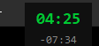
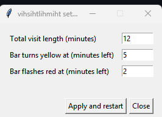

# vihsihtlihmiht

> “You have 15 minutes—to establish rapport, do the med rec, examine the patient, listen to your preceptor’s stories, and place your orders. Here, take this.”

A tiny timer bar for medical visits (or any timed meeting) that lives along the
very top edge of your screen.

- **Hairline thin** — at most 0.5 mm tall (1–2 px), so it never gets in the way.
- **Reserves its own space** — the bar registers as a Windows AppBar, so
  maximized windows sit *below* it instead of sliding underneath.
- **Traffic-light timing** — the strip fills left to right as time passes:
  - **green** while more than 5 minutes remain
  - **yellow** at 5 minutes or less
  - **flashing red** at 2 minutes or less, and after time runs out
- **Built-in stopwatch** — a small always-on-top readout shows elapsed time and
  time remaining (or overtime, in red). Drag it anywhere; right-click hides it.
- **Configurable** — right-click the bar to set the visit length and the
  yellow/red thresholds; settings are remembered between runs.

## Screenshots

Green — filling up, plenty of time left:


Yellow — 5 minutes or less left:


Red — 2 minutes or less (flashes):


The stopwatch (draggable, always on top):



Settings (right-click the bar):



## Download

Standalone builds are on the [Releases](../../releases) page. No installation,
no Python required — both run a 12-minute visit by default.

### Windows

Grab `vihsihtlihmiht.exe` and double-click it.

To time a different length, create a shortcut to the exe, open its
**Properties**, and append the number of minutes to the *Target* field, e.g.
`... vihsihtlihmiht.exe 20` — or just right-click the bar and use the settings.

### Linux

Grab `vihsihtlihmiht-linux`, then:

```
chmod +x vihsihtlihmiht-linux
./vihsihtlihmiht-linux 20        # optional: minutes
```

The binary is built on Ubuntu; on an older distro (or if it complains about
glibc) run from source instead — it's a single file with no dependencies beyond
Python and tkinter.

### macOS

No prebuilt binary — run from source (see below).

## Controls

| Action | Effect |
| --- | --- |
| Right-click the bar | Open settings (total time, yellow/red thresholds) |
| Triple-click the bar | Close everything (single/double clicks do nothing) |
| `Esc` | Close everything |
| Drag the stopwatch | Move it |
| Right-click the stopwatch | Hide it |

## Settings

Right-click the bar to open the settings window:

- **Total visit length** (minutes) — default 12
- **Bar turns yellow at** (minutes left) — default 5
- **Bar flashes red at** (minutes left) — default 2

*Apply and restart* saves the settings and restarts the timer with the new
values. Settings live at:

| Platform | Path |
| --- | --- |
| Windows | `%APPDATA%\vihsihtlihmiht\settings.json` |
| Linux | `~/.config/vihsihtlihmiht/settings.json` (respects `$XDG_CONFIG_HOME`) |
| macOS | `~/Library/Application Support/vihsihtlihmiht/settings.json` |

## Run from source

Requires Python 3.8+ with tkinter. No third-party dependencies. Pick the script
for your platform:

```
python visit_bar.py [minutes]          # Windows
python3 visit_bar_linux.py [minutes]   # Linux
python3 visit_bar_mac.py [minutes]     # macOS
```

The optional `minutes` argument overrides the saved visit length.

tkinter ships with the standard Windows and macOS Python installers. On Linux
it's usually a separate package:

```
sudo apt install python3-tk       # Debian/Ubuntu
sudo dnf install python3-tkinter  # Fedora
sudo pacman -S tk                 # Arch
```

Convenience launchers: `visit_bar.bat` on Windows (runs without a console
window), `visit_bar.sh` on Linux/macOS (picks the right script for your OS).

## Platform support

Each platform has its own standalone script. They share no code, so a change to
one can't break another.

| Platform | Script | Status | Reserves screen space |
| --- | --- | --- | --- |
| Windows | `visit_bar.py` | Supported | Yes — registers a Windows AppBar |
| Linux (X11) | `visit_bar_linux.py` | Supported | Yes — `_NET_WM_STRUT_PARTIAL` |
| Linux (Wayland) | `visit_bar_linux.py` | Runs under XWayland | No — see below |
| macOS | `visit_bar_mac.py` | Experimental, untested | No |

**Linux/X11** is the fully supported Linux path, tested on Xfce (xfwm4) with a
dual-monitor setup. Any EWMH-compliant window manager — KDE, GNOME/Mutter on
X11, i3, Openbox — honours the same hint. The bar spans the *primary* monitor
only, not the whole virtual desktop.

Two Linux-only quirks worth knowing:

- The bar is a **dock window**, so it never takes keyboard focus and `Esc`
  won't reach it. Right-click the **stopwatch** for a menu (settings, hide,
  quit) — that's the reliable way out.
- Under **Wayland** there is no strut equivalent that tkinter can reach (it
  would need the layer-shell protocol), so the bar floats on top but maximized
  windows slide underneath. Log into an X11/Xorg session for the full effect;
  the script prints a note when it detects Wayland.

**macOS** is written but has **not been run on a Mac** — no space reservation is
possible without private APIs, so the bar is a plain floating window pinned just
below the menu bar. If it's hidden behind your menu bar (common on notched
Macs), nudge it down:

```
VISIT_BAR_TOP_OFFSET=38 python3 visit_bar_mac.py
```

Bug reports welcome.

## License

[MIT](LICENSE)
